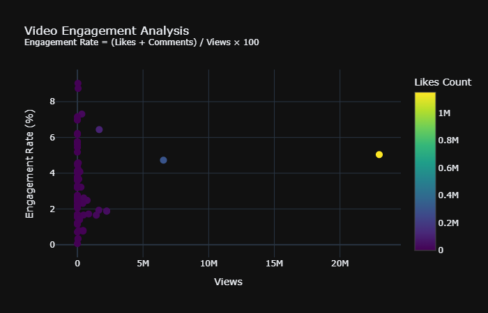

# YouTube Video Transcript Analysis
## Overview
An interactive dashboard for analyzing YouTube videos based on their transcripts. This project focuses on collecting and analyzing video transcripts along with metadata to provide insights about content performance, engagement metrics, and sentiment analysis.

## Features

Video Filtering: Analyzes only videos with available English transcripts

Comprehensive Analysis:
- Channel performance metrics
- Video engagement analysis
- Transcript sentiment analysis
- View count vs transcript length correlation

Interactive Visualizations:
- Top performing channels
- Engagement rate distributions
- Sentiment analysis trends
- Transcript length correlations

Metrics Dashboard:
- Total and average views
- Engagement rates
- Transcript statistics
- Channel performance

Prerequisites

- Python 3.7+
- YouTube Data API v3 key
- Google Cloud Console account

## Installation

1. Clone the repository:

```bash
git clone https://github.com/yourusername/youtube-transcript-analysis.git  
cd youtube-transcript-analysis
```

2. Install Required Packages:

`pip install -r requirements.txt`

3. Set up your YouTube API key:
- Get an API key from Google Cloud Console
- Enable YouTube Data API v3

4. Run the notebook

## Sample Outputs

<p align="left">
  
</p><br/>
<p align="left">
  
</p><br/>
<p align="left">
  
</p><br/>
<p align="left">
  
</p><br/>

## Metrics Explained

- Engagement Rate: (Likes + Comments) / Views × 100
- Transcript Length: Word count of video transcripts
- Sentiment Score: Positive/Negative classification of transcript content

## Limitations

- Only analyzes videos with available English transcripts
- Limited by YouTube API quotas
- Maximum 5000 videos per search query
  
## License

This project is licensed under the MIT License - see the LICENSE file for details.

## Contact

Email: subedikad@gmail.com <br />
LinkedIn: www.linkedin.com/in/subedika-debbarma

## Future Improvements

- Add support for multiple languages
- Implement more advanced NLP analysis
- Add video category analysis
- Implement caching for API requests
- Add more visualization options
